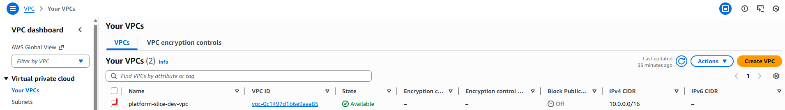
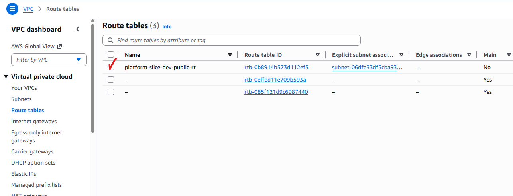
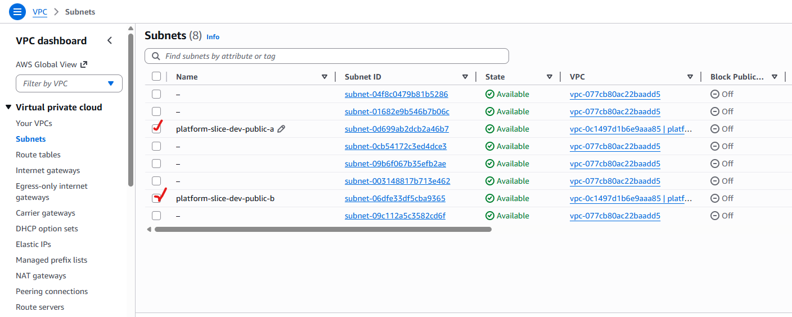
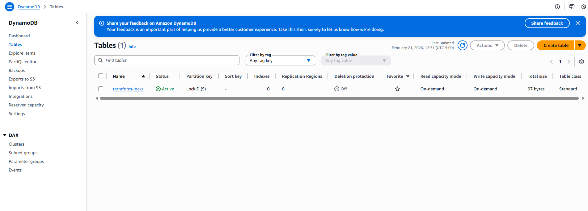
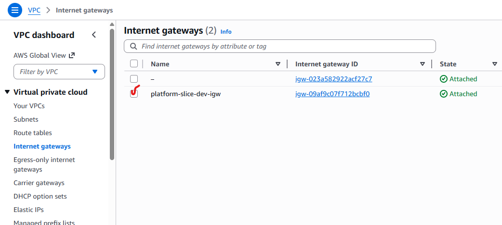
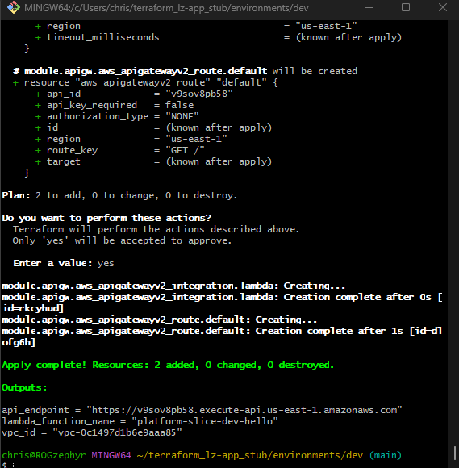
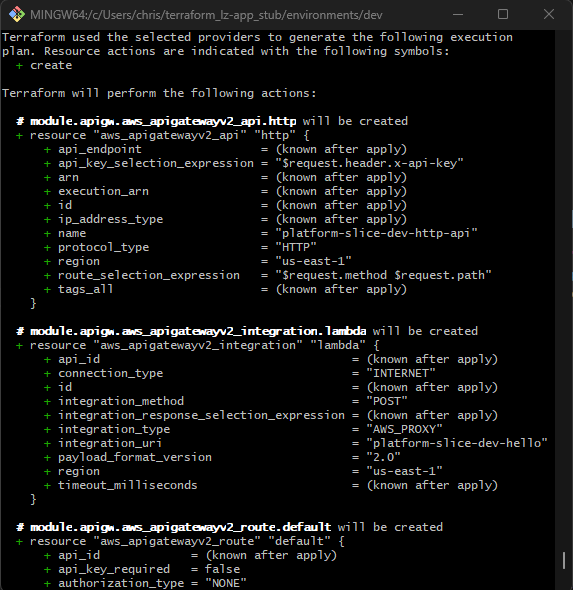
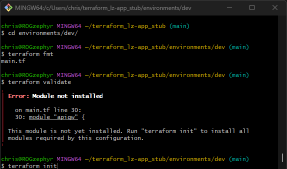
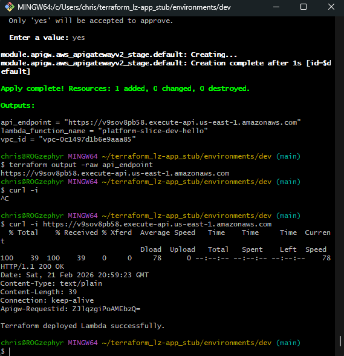

# terraform_lz-app_stub

This project provisions a minimal AWS environment using Terraform, including: 

- Remote state backend (S3 + DynamoDB locking)
- VPC with public subnets
- IAM roles
- Lambda function
- HTTP API Gateway

  ## Goals

  - Demonstrate infrastructure-as-code funcamentals
  - Use modular Terraform structure
  - Implement remote state and locking
  - Apply cost-conscious design

## Screenshots
- VPC
  

- Public Route Table
  

- Subnets
  

- DynamoDB
  

- Internet Gateway
  

- API Endpoint Created
  

- API Creation Bash Output
  

- Terraform Missing Module Fix
  

- Successful Lambda Execution Curl
  

